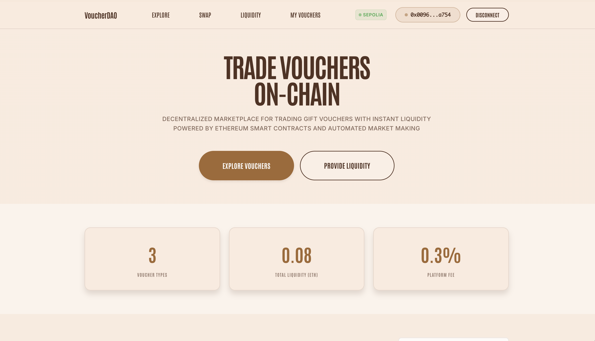
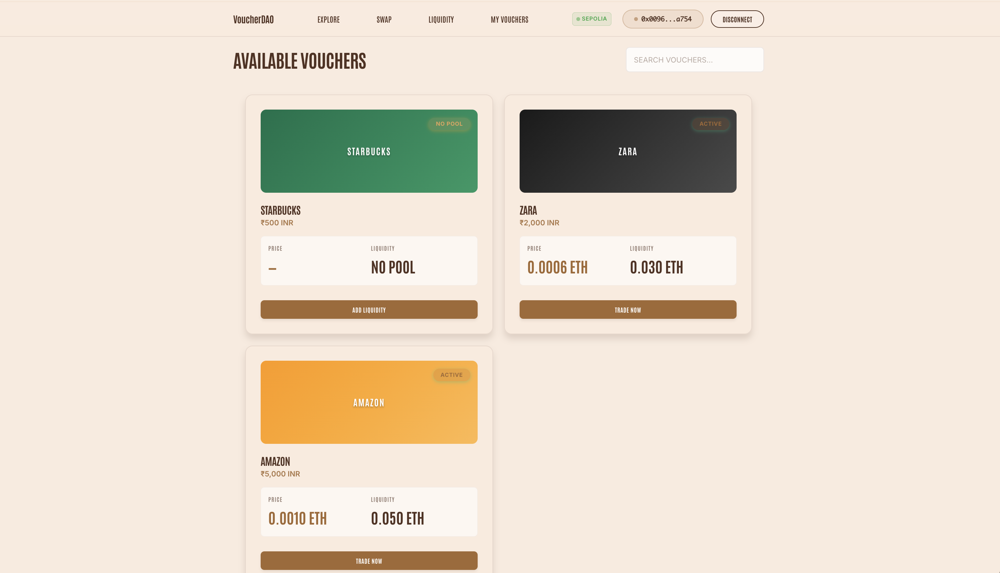
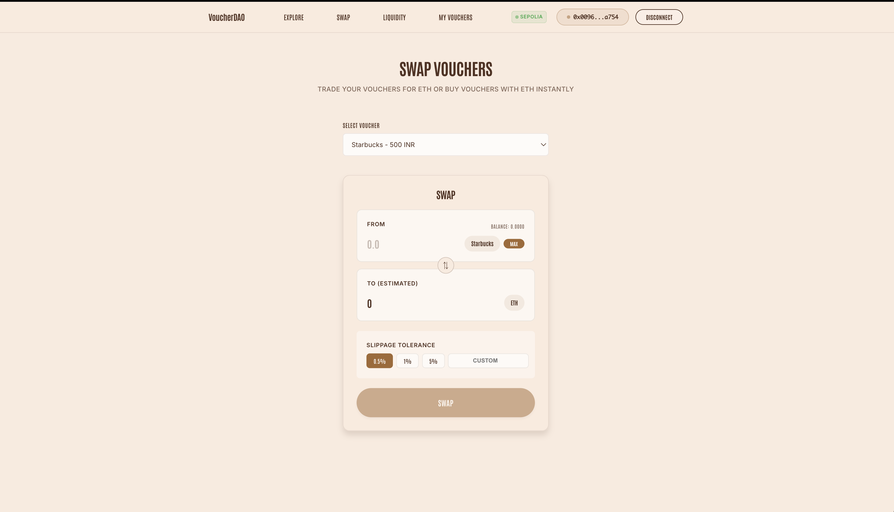
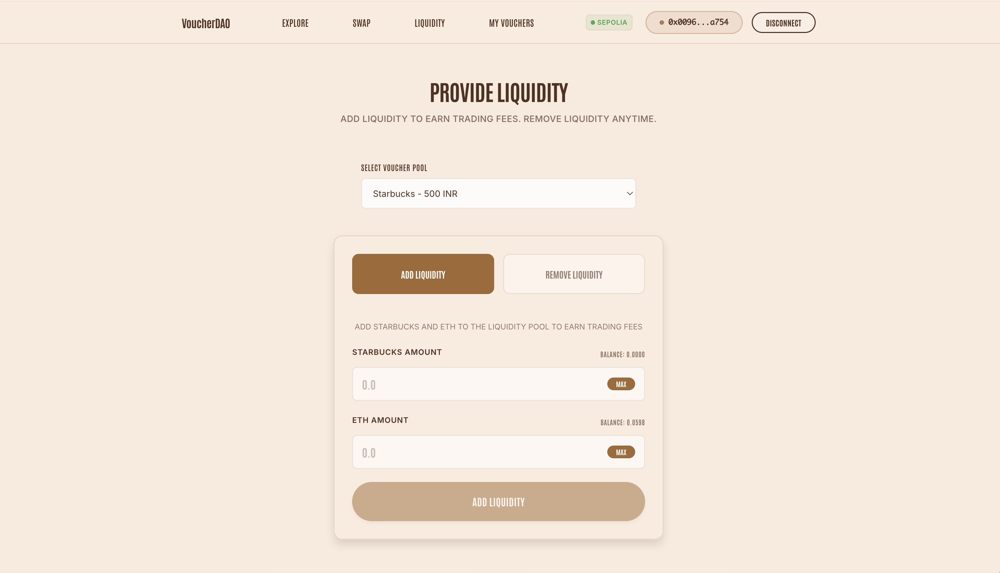
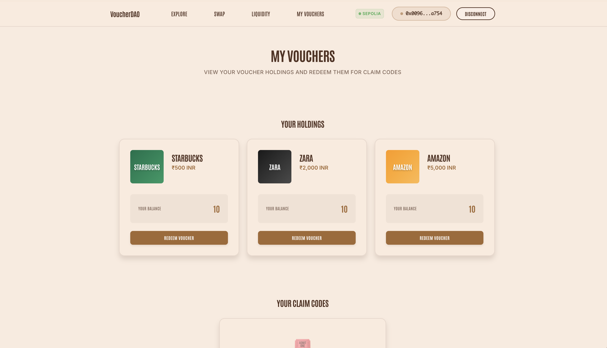
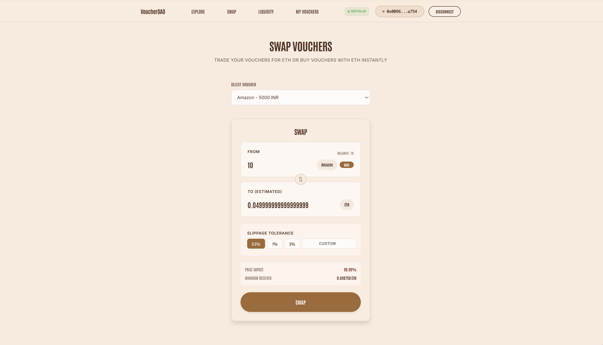

# VoucherDAO

**Turn unused gift cards into liquid on-chain assets.**

---

## 🎯 The Problem

Billions of dollars in gift cards go unused or expire every year. People get stuck with vouchers they don't want, and there's no easy way to trade or liquidate them.

## 💡 The Solution

VoucherDAO creates a decentralized marketplace where gift vouchers become tradeable ERC-1155 tokens. Using an AMM (Automated Market Maker), users can:

- **Swap** vouchers for ETH instantly
- **Add liquidity** to earn trading fees
- **Redeem** vouchers for real-world claim codes

---

## 📸 Screenshots













---

## 🏗️ Architecture

```
┌─────────────────┐     ┌─────────────────┐     ┌─────────────────┐
│    Frontend     │────▶│    Backend      │     │   Blockchain    │
│   (React/Vite)  │     │  (Node/Express) │     │   (Ethereum)    │
└────────┬────────┘     └────────┬────────┘     └────────┬────────┘
         │                       │                       │
         │  API Calls            │  Prisma ORM           │  Smart Contracts
         │                       │                       │
         ▼                       ▼                       ▼
    ┌─────────┐            ┌─────────┐            ┌─────────────┐
    │ MetaMask│            │SQLite DB│            │VoucherToken │
    │ Wallet  │            │         │            │LiquidityPool│
    └─────────┘            └─────────┘            │   Escrow    │
                                                  └─────────────┘
```

---

## 📁 Project Structure

```
voucher-dao/
├── frontend/          # React + Vite frontend
├── backend/           # Node.js + Express API
└── web3/              # Solidity smart contracts
```

### Frontend (`/frontend`)
- **React 18** with Vite
- **ethers.js v5** for blockchain interactions
- Custom hooks: `useWallet`, `useContract`
- Pages: Home, Swap, Liquidity, MyVouchers, VoucherDetail

### Backend (`/backend`)
- **Express.js** REST API
- **Prisma ORM** with SQLite
- Routes: voucher-meta, redemptions, uploads
- Handles off-chain metadata and claim codes

### Web3 (`/web3`)
- **Hardhat** development environment
- **Solidity ^0.8.20** contracts:
  - `VoucherToken.sol` - ERC-1155 voucher tokens
  - `LiquidityPool.sol` - AMM with swap & liquidity
  - `Escrow.sol` - Secure redemption handling

---

## 🛠️ Tech Stack

| Layer | Technology |
|-------|------------|
| Frontend | React, Vite, ethers.js v5 |
| Backend | Node.js, Express, Prisma, SQLite |
| Blockchain | Solidity, Hardhat, Ethereum Sepolia |
| Wallet | MetaMask |

---

## 🚀 Quick Start

```bash
# Backend
cd backend && npm install && npm run dev

# Frontend
cd frontend && npm install && npm run dev

# Smart Contracts
cd web3 && npm install && npx hardhat compile
```

---

## 👥 Built By

**Team Baked** 🍞
